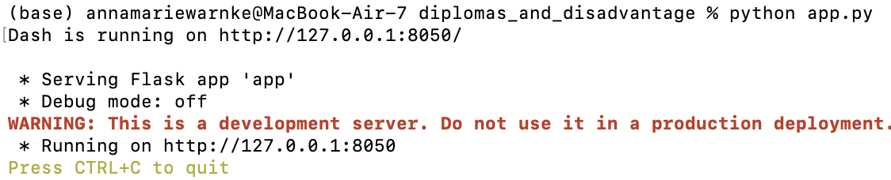
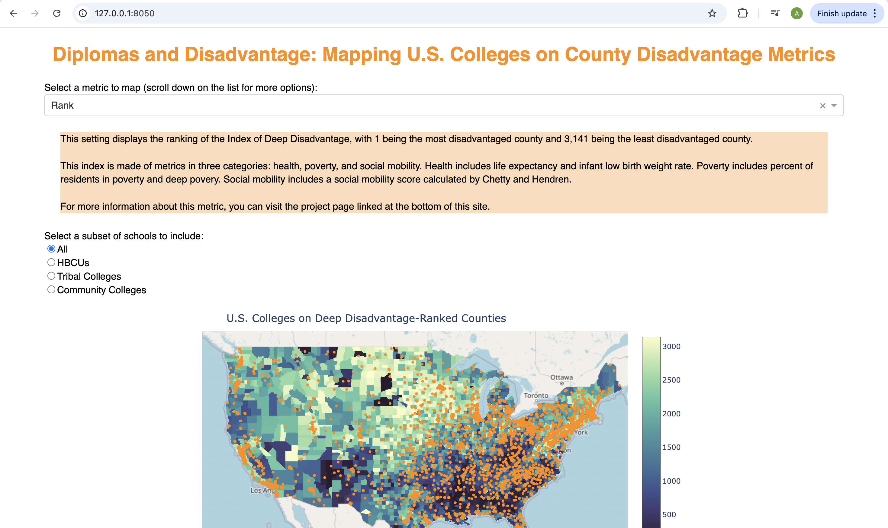
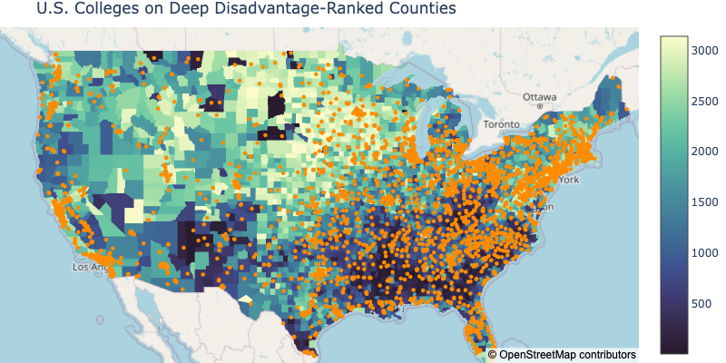

# Diplomas and Disadvantage: Mapping U.S. Colleges on County Disadvantage Metrics

## Introduction

Over 2/3 of postsecondary students attend a school within 50 miles within their home. Community advantages and colleges are both scattered unequally across the country; what might their intersection mean for students? The *Diplomas and Disadvantage* Dash app hopes to introduce the American public and policymakers to this question by providing a mapping tool with several subsets of colleges and over a dozen county metrics. This tool is meant for visualization purposes, not for statistical analysis; those who wish to explore the relationships they find more deeply can visit University of Michigan's Understanding Communities of Deep Disadvantage page to download the county-level disadvantage data.

More details about the origin of this project can be found in `Writeup.pdf`.

## Running the Dash app

Running the app requires the following packages:
* pandas
* geopandas ([installation instructions](https://geopandas.org/en/stable/getting_started.html))
* shapely
* plotly ([installation instructions](https://plotly.com/python/getting-started/))
* urllib
* json
* dash ([installation instructions](https://dash.plotly.com/installation))
* dash_dangerously_set_inner_html ([installation instructions](https://github.com/plotly/dash-dangerously-set-inner-html))

Once you ensure that you have the necessary packages, clone this repository and run the command `python app.py`. This command will let you know the port that the app is running on, and then you can open the page in your web browser.

Example of running the `python app.py` in Mac Terminal:

This is what the page looks like in a web browser:

On this page, you can select disadvantage metrics in the dropdown menu, choose a subset with the radio buttons, and toggle off or on tooltips under the map. 

## Generating the plotly map alone

If you would like to generate the plotly map alone instead of the web app, you can use `create_map.py` in the `src` folder. If you run the command `python src/create_map.py`, the resulting map will be saved as `figures/basic_map.html`, and you can open the map in a web browser. You can open the current `figures/basic_map.html` file in the respository to see the output of `create_map.py`, and `figures/basic_map_snapshot.png` to see a static view of this map.

## Other files in this repository

The `assets` folder contains three files:
* `app_elements.css`: contains the CSS that sets margins and line heights for the body of the Dash page
* `favicon.ico`: favicon (small image displayed next to the page title in the browser tab) for the Dash page
* `typology.css`: contains the CSS that sets the font family and font colors for the page

The `figures` folder contains the `basic_map` files as well as the screenshots used for the README.

The `raw_data` folder contains two files:
* `CSV_10312024-789.csv`: contains the postsecondary institution data
* `Index of Deep Disadvantage - Updated.xlsx`: contains the disadvantage data
More details about these files can be found in `Writeup.pdf`.

The `src` folder contains two files:
* `create_map.py`: contains the `collect_and_clean` and `create_map` functions for `app.py`, or can be used on its own to generate a plotly map
* `util.py`: contains functions for `create_map.py` and `app.py` that are mainly used for text and filtering for the metric and subset settings

`Writeup.pdf`: contains more information about the project background and data sources